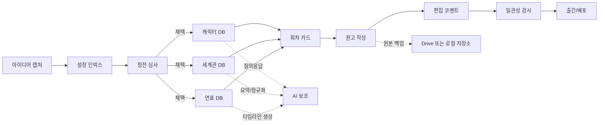
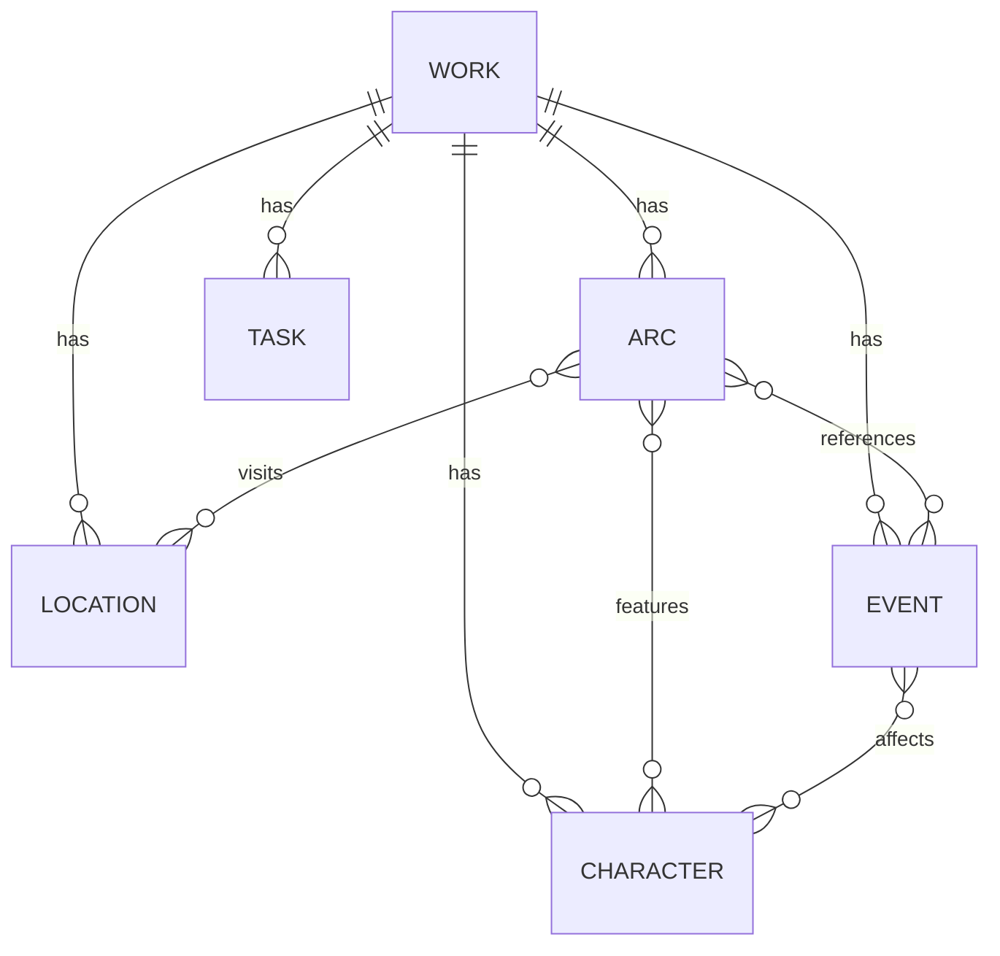

# 온라인으로 작품 설정과 맥락을 관리하는 방법과 실제 사례

## Executive summary

장편 소설, 웹툰, 게임 시나리오처럼 설정이 누적되는 작업은 결국 “원고”보다 “참조 시스템”이 더 중요해지는 경우가 많다. 이번 조사에서 확인된 핵심은 다음과 같다. 첫째, **개인 작가**는 대체로 노션·구글 문서·스크리브너처럼 진입장벽이 낮고 검색이 쉬운 도구를 선호한다. 둘째, **다인 협업팀**은 구글 드라이브/문서, 슬랙, 지라·컨플루언스 계열처럼 권한·이력·알림·이슈 트래킹이 강한 조합으로 이동한다. 셋째, **세계관이 큰 IP**는 위키형 구조 또는 전용 월드빌딩 툴이 장기 유지에 유리하다. 넷째, AI는 “창작 대행”보다 **설정 질의응답, 일관성 검사, 회의·취재 정리, 캐릭터/타임라인 시트 자동화**에서 실무 효용이 높았다. 다만 AI의 장문 드리프트, 환각, 저작권·계약 이슈는 여전히 구조적 한계다.

실무적으로는 다음 원칙이 가장 안전했다. **원고와 설정은 분리**, **설정은 DB/위키화**, **파일 원본은 드라이브/로컬 이중보관**, **AI에는 최소권한·비공개 범위만 제공**, **외부 공유는 링크권한을 만료·비밀번호·워터마크·내보내기 정책과 함께 운영**하는 방식이다. 개인은 “노션 또는 스크리브너 + 드라이브 백업”, 소규모 팀은 “노션 또는 구글 문서 + 슬랙”, 중대형 IP 팀은 “위키/컨플루언스 + 지라 + 슬랙 + 원본 스토리지”가 가장 재현성이 높다.

본 보고서의 비용 표기는 **2026-06-16 기준 공식 페이지 노출값**을 우선 사용했고, 지역별 통화·세금·프로모션 차이가 있는 항목은 “공식 요금제 존재” 또는 “시작가” 위주로 적었다. 사용자가 별도 예산 제약을 제시하지 않았으므로 **가정은 no specific constraint**로 두었다.

## 조사 범위와 판단 기준

이번 조사는 사용자를 기준으로 도구를 여섯 묶음으로 나눴다. **노션**, **구글 드라이브/문서**, **미디어위키·비공개 위키**, **전용 작가용 툴**(Scrivener, World Anvil), **협업 커뮤니케이션**(Slack), **이슈·프로젝트 관리**(Jira)다. 비교 기준은 기능, 운영 방식, 장단점, 보안 통제, 비용, 그리고 실제 현업에 바로 적용 가능한 워크플로우였다. 공식 문서·공식 블로그·원문 인터뷰·작가/실무자 본인 글을 우선했고, 불충분한 항목은 “미확인”으로 남겼다.

도구 선택에서 가장 큰 분기점은 세 가지였다. 하나는 **원고 작성 중심인지, 레퍼런스/설정 관리 중심인지**이고, 둘째는 **혼자 쓰는지, 팀이 같이 쓰는지**, 셋째는 **보안 민감 정보가 있는지**다. 예를 들어 Scrivener는 구조화된 초고 작성에 강하지만 실시간 공동편집에는 약하고, MediaWiki는 세계관 아카이브에는 강하지만 초기 구축과 보안 패치 관리 부담이 있다. 반면 Google Docs는 공동편집과 버전 이력은 우수하지만 장편 IP를 데이터베이스처럼 구조화하는 데는 노션·위키보다 약하다.

아래 표는 도구별 실무 적합성을 압축한 것이다.

| 도구군            | 대표 도구                | 주 사용 방식                                  | 강점                                                           | 약점                                                                 | 보안·권한                                                              | 비용                                                                                                        | 적합한 팀                 |
| ----------------- | ------------------------ | --------------------------------------------- | -------------------------------------------------------------- | -------------------------------------------------------------------- | ---------------------------------------------------------------------- | ----------------------------------------------------------------------------------------------------------- | ------------------------- |
| 문서형 DB         | Notion                   | 작품/캐릭터/세계관 DB, 위키, 일정·대시보드    | 검색·링크·DB·권한·페이지 구조가 균형적                         | 대용량 이미지·원본 파일 관리에는 비효율, 오프라인/내보내기 설계 필요 | 2FA, SSO/SCIM, 감사로그, 외부공유 제한, 워크스페이스 내보내기 제공     | 무료~엔터프라이즈, 공개 페이지상 Plus/Business/Enterprise 제공                | 개인~중간 규모            |
| 클라우드 문서     | Google Drive / Docs      | 초고, 회의록, 시놉시스, 공동편집, 파일 저장소 | 동시편집, 댓글·제안, 명명 버전, 파일 버전 관리                 | 세계관을 관계형 구조로 누적 관리하기엔 제한적                        | 공유 범위, 명명 버전, DLP/분류 라벨/보존 규칙 가능                     | 개인용 무료, Workspace 유료 플랜 제공        | 개인~대형 조직            |
| 위키형 지식베이스 | MediaWiki / private wiki | 설정 사전, 연표, 용어집, 링크드 지식          | 장기 검색성·문맥 연결 최강, 대형 IP에 유리                     | 구축·테마·권한·백업·패치 운영 부담                                   | 접근 제한 가능하나 사설 위키는 보안 업데이트 필수, 취약점 방치 위험 큼 | 소프트웨어는 오픈소스, 운영비는 서버·관리 인력에 좌우                       | 큰 세계관·사내 위키       |
| 전용 원고 툴      | Scrivener                | 장면/장별 집필, 연구노트, 컴파일              | 초고 구조화, 챕터 단위 관리, 연구자료 묶기 좋음                | 실시간 협업 약함, 동시편집 부적합                                    | 로컬 중심, Dropbox 동기화 가능하나 동시 오픈 금지 권장                 | macOS 신판 $59.99, iOS $23.99, 번들/업그레이드 정책 존재  | 개인 작가                 |
| 전용 월드빌딩 툴  | World Anvil              | 설정, 지도, 타임라인, 가계도, 매뉴스크립트    | 세계관·설정 관리 특화, 독자 공개/비공개 제어, 맵·타임라인 강함 | 범용 협업툴 생태계보다 기업 통합은 약함                              | Content Privacy, 고급 접근 공유, 비밀번호·액세스 코드 등 제공          | Master 연 $4.50/월, Grandmaster 연 $8.25/월, Sage 연 $25/월 표기              | 판타지/SF·TTRPG·IP 운영   |
| 대화형 협업       | Slack                    | 논의, 승인, 알림, 요약, 외부 파트너 채널      | 속도, 채널 구조, 파일·대화 검색, 외부 협업                     | 설정의 “원본 저장소”로 쓰면 지식이 흩어짐                            | 기본 암호화, EKM/DLP/감사로그, 보존 정책, Slack Connect                | 무료 90일 검색, Pro $7.25 사용자/월(연간)부터                    | 모든 협업팀               |
| 이슈형 관리       | Jira                     | 에픽·스프린트·태스크·승인·의존성              | 일정·이슈·승인·자동화·대시보드 강력                            | 창작문서 그 자체를 쓰기엔 과함                                       | 권한·외부 협업·데이터 레지던시·자동화·SSO/SCIM                         | Standard $7.91, Premium $14.54, Enterprise 별도 문의                          | 중대형 팀, 웹툰/게임 제작 |

툴을 한 개만 고르기보다, 실제로는 **문서 원본 층 + 참조 지식층 + 커뮤니케이션 층 + 작업 추적 층**의 조합으로 굴리는 편이 훨씬 안정적이다. 예를 들어 “Scrivener + Drive”, “Notion + Google Docs”, “MediaWiki/Confluence + Jira + Slack”이 대표적인 실무 조합이다. 공식 제품 문서들도 각각 원고 관리, 버전·권한, 검색·요약, 이슈·자동화에 초점이 분리되어 있음을 보여준다.

## 온라인 툴별 사용 방식과 실무 워크플로우

### 노션

노션은 개인 작가부터 소규모 스튜디오까지 가장 범용적으로 쓰기 쉬운 “설정 위키 + 대시보드 + 간이 PM” 도구다. 데이터베이스, 링크드 페이지, 팀스페이스, 차트, 폼, 페이지 이력, PDF/HTML/Markdown·CSV 내보내기, 2단계 인증, SSO/SCIM, 감사로그까지 지원해 “작품 설정, 일정, 커뮤니케이션 잔존물”을 한 공간에 모으기 좋다. 특히 **캐릭터·장소·조직·사건·회차**를 각각 DB로 두고 relation/rollup으로 연결하면, 작품이 길어질수록 검색성과 추적성이 좋아진다. 다만 원본 PSD/CLIP, 고용량 동영상, 대체 불가능한 최종 원고 보관은 별도 드라이브를 두는 편이 안전하다.

실무 워크플로우는 대개 이렇다. “작품 홈 → 인물/세계관/연표 DB → 회차 카드 → 체크리스트 → 회의록/취재 노트 → 출판/프로모션 관리” 식으로 올라간다. 노션은 팀스페이스 비공개 설정과 외부공유 제한이 가능한 만큼, **팀 공용 설정문서**와 **작가 개인 초안문서**를 분리해 두는 게 좋다. Enterprise 이상에서 감사로그·DLP/SIEM 연동이 가능하므로 출판사나 스튜디오라면 일반 Plus보다 보안 통제가 훨씬 낫다.

### 구글 드라이브와 구글 문서

구글 문서는 **공동 집필·코멘트·제안 모드**에 가장 강하고, 구글 드라이브는 **원고·표지·자료 파일 저장소** 역할에 강하다. 공식 도움말 기준으로 Docs는 버전 이력과 명명 버전을 지원하고, Drive는 파일 버전 관리와 영구 보관 기능을 제공한다. Google Workspace 관리 기능에서는 분류 라벨, DLP, 보존 규칙까지 연동할 수 있어, 조직형 운영이면 개인용보다 관리성이 훨씬 높다.

이 조합의 장점은 **협업자 대부분이 이미 익숙하다**는 점이다. 회의록·시놉시스·대본·시즌 구성표는 Docs에서 바로 협의하고, 무거운 원본 파일은 Drive 폴더 규칙으로 관리하면 된다. 다만 인물·세계관·설정 충돌을 관계형으로 쌓아 가는 용도는 노션/위키보다 약하므로, 장편 IP는 Docs를 “원고 층”, 노션/위키를 “정답 사전 층”으로 분리하는 편이 낫다. Google Workspace 유료 플랜은 Business 계열과 Enterprise 계열로 나뉘며, Business 계열은 최대 300명까지 구매 가능하다.

### 미디어위키와 비공개 위키

사설 위키는 “작품 세계의 사전”을 만드는 방식이다. MediaWiki는 페이지 링크 구조, 분류, 템플릿, 검색에 강해서 인명·지명·조직·설정 규칙·연표를 **정전(canon) 문서**처럼 운영하기 좋다. 작품이 커질수록 “단일 긴 문서”보다 “짧은 위키 페이지 다수”가 더 강해진다.

단점도 뚜렷하다. MediaWiki는 권한 제어를 할 수 있지만, 사설 위키 운영은 패치·백업·서버관리까지 책임져야 한다. 2025년에는 구버전 private wiki에서 **비공개 페이지가 노출될 수 있는 취약점(CVE-2025-6590)**이 공지돼, private wiki라면 업그레이드가 사실상 필수였다. 따라서 작가 개인이 단독으로 장기간 운영한다면 기동성은 좋지만, 보안 역량이 약하면 오히려 위험해질 수 있다.

### Scrivener와 World Anvil

Scrivener는 “원고 쓰기”에, World Anvil은 “세계관 운영”에 최적화가 다르다. Scrivener는 챕터를 문서 단위로 쪼개고 연구자료·사진·링크·노트를 프로젝트 안에 함께 넣어 초고를 관리하기 좋다. 반면 공식 포럼에서는 **동시 다중 작성자 편집을 전제로 설계된 도구가 아니며**, 협업하려면 접근 조율이 필요하다고 명시한다. Dropbox 동기화는 가능하지만 두 기기에서 같은 프로젝트를 동시에 열지 않는 것이 권장된다.

World Anvil은 반대로 **세계/연표/지도/가계도/백과사전/매뉴스크립트**를 한데 묶는 데 초점이 있다. 공식 가격 페이지에는 Master, Grandmaster, Sage 티어가 표시되어 있고, Content Privacy, 타임라인, Manuscripts, Whiteboards, Family Trees, Custom Statblocks, Advanced Access Sharing 같은 기능이 단계적으로 열린다. 특히 Sage 티어는 스튜디오·출판사 지향으로 커스텀 도메인, 대량 접근 관리, 접근 코드, 화이트 라벨링을 제공한다. 거대한 판타지·SF·멀티미디어 IP에 특히 잘 맞는다.

### Slack과 Jira

슬랙은 저장소라기보다 **반응 속도**를 책임지는 도구다. 채널 단위로 회차, 이슈, 편집 피드백, 번역, 출판 커뮤니케이션을 분리하고, 캔버스/리스트/워크플로우로 간단한 문서와 작업을 붙일 수 있다. 유료 플랜에서는 AI 대화 요약, 하डल 노트, 보존 정책, 무제한 검색, 외부 협업(Slack Connect)이 강화된다. 따라서 Slack의 적절한 위치는 “대화와 승인”, “지식 원본은 Notion/Docs/Wiki”다.

Jira는 창작 그 자체보다 **마감·의존성·승인·우선순위**에 가치가 있다. Standard 이상에서 역할·권한, 외부 협업, 다중 지역 데이터 레지던시, 자동화, 무제한 저장소, 승인 프로세스, SLA가 강화된다. 웹툰·게임처럼 콘티→작화→채색→편집→QA 또는 스토리→퀘스트→시네마틱→검수처럼 파이프라인이 긴 팀일수록 효과가 크다. 다만 개인 작가에게는 과도하고, 스튜디오 단계부터 본격 도입하는 편이 맞다.

## 실제 작가와 팀 사례

다음 표는 요구 조건에 맞춰 **최소 8개 이상**, 그중 **국내 4개 이상**을 포함해 정리한 실제 사례다. “미확인”은 공개 출처에서 도구/성과를 더 구체적으로 확정할 수 없었던 부분이다.

| 구분                         | 주체                             | 국가 | 도구                              | 확인된 사용 방식                                                                                                              | 관찰 포인트                                                              |
| ---------------------------- | -------------------------------- | ---: | --------------------------------- | ----------------------------------------------------------------------------------------------------------------------------- | ------------------------------------------------------------------------ |
| 웹소설 작가 템플릿           | 픽글 + 현직 웹소설 작가 협업     | 한국 | Notion                            | home/input/writing/work/archive 5개 스페이스, D-day, 타임라인, 캘린더, 목표·달성 글자수, 작품 관리, 출판사·프로모션·수익 관리 | **개인 창작과 사업 관리가 한 공간에 합쳐진 전형적 노션형 운영**          |
| 커미션 작가 관리             | Blue-Zao                         | 한국 | Notion                            | 커미션 관리 DB, 입금·마감·분량·컨펌 회차, 롤업, 파일 업로드 백업                                                              | **작가형 DB 설계의 미시 사례**. 납기·정산·샘플 관리가 핵심               |
| 창작 준비형 개인 사례        | 윤채                             | 한국 | Notion + AI 학습                  | AI 학습 중 떠오른 설정을 노션 메모로 축적, 세계관으로 발전                                                                    | **아이디어→설정화** 단계에서 노션이 기억 보조장치로 작동                 |
| 웹툰 제작 관찰               | 송범근                           | 한국 | Google Drive/Dropbox 등           | 다수 웹툰 협업자가 CLIP/PSD를 이메일·메신저·웹하드·구글드라이브/드롭박스로 전달, 버전 관리와 피드백이 번거롭다고 지적         | **국내 웹툰 제작의 실제 병목**이 파일 전달과 버전 피드백에 있음을 보여줌 |
| 시나리오·퀘스트 팀 채용 공고 | 네오플 던전앤파이터 모바일 2D 팀 | 한국 | Confluence, Jira, SVN, Git, Slack | 시나리오·퀘스트·시네마틱 기획/제작 직무에서 협업 툴 숙련을 우대                                                               | **게임 내러티브 팀은 설정만이 아니라 구현 파이프라인과 묶여 움직임**     |
| 저자 집필 사례               | Simone Stolzoff                  | 미국 | Notion                            | 책 집필을 위해 Notion으로 구조와 조직을 잡았다는 공식 소개                                                                    | **작가 1인 장기 프로젝트에 노션이 충분히 작동**함을 보여줌               |
| 아동·청소년 작가 사례        | Lisa Yee                         | 미국 | Scrivener                         | 10년 이상 사용, 연구·링크·사진·챕터를 프로젝트 안에 넣고 각 챕터를 별도 문서로 관리, 마지막에 compile                         | **초고 구조화와 참조 자료 집적**에 Scrivener 강세                        |
| 공개 협업 소설               | Martin Jackson                   | 영국 | Google Docs                       | Google Docs에서 소설을 라이브로 쓰고 독자가 코멘트·리서치·기여                                                                | **문서형 플랫폼을 공개 협업 실험장으로 쓴 드문 사례**                    |
| 로맨스 베스트셀러 사례       | Abby Jimenez                     | 미국 | Google Docs                       | 모든 책의 초고를 휴대폰 Google Docs로 작성, 이후 노트북에서 편집자 협업                                                       | **모바일 접근성과 저마찰 캡처**가 강점                                   |
| 시리즈 바이블 운영           | Sarra Cannon                     | 미국 | Private wiki                      | Shadow Demons Saga 시리즈 바이블을 private wiki로 운영, 키워드 검색으로 시리즈 전체 참조                                      | **장기 시리즈에는 위키형 검색성이 강력**                                 |

이 사례들을 한 줄로 요약하면 다음과 같다. **노션은 개인/소규모 작가의 “운영 체제”**, **Google Docs는 공동초안과 빠른 캡처**, **Scrivener는 깊은 초고 구조화**, **위키는 장기 세계관의 정전 사전**, **Jira/Slack은 구현과 협업 파이프라인**에 강했다. 국내 사례에서는 특히 **웹툰·게임 쪽이 파일 전달과 파이프라인 관리 문제**를 강하게 드러냈다.

## AI로 설정 관리와 일관성 문제를 푸는 실제 사례

AI는 아직 “한 번에 장편을 안전하게 맡기는 도구”라기보다, **설정 관리의 주변 업무**를 빠르게 정리하는 도구로 훨씬 유효했다. 특히 취재·회의 요약, 설정 질의응답, 연표·캐릭터 시트 초안, 오류 탐지, 대체 문안 탐색에 효율이 집중됐다. 반면 장문 컨텍스트 유지, 장르 톤 보존, 저작권/계약·비밀유지 조건 충돌은 여전히 한계였다.

| 사례                      | 도구             | 용도                                                 | 확인된 효과                                                    | 한계/주의점                                                      |
| ------------------------- | ---------------- | ---------------------------------------------------- | -------------------------------------------------------------- | ---------------------------------------------------------------- |
| 네버슬립의 작가 강의 실무 | Notion AI        | 인터뷰/회의 자동 받아쓰기, 자동 요약, 후속 인풋 정리 | 취재·미팅 내용을 놓치지 않고 나중에 글감/정리자료로 재사용     | 비즈니스 요금제 필요, 자동 요약은 검수 필수                      |
| Christie Bickelman        | ChatGPT          | 원고 연속성·사실 일관성 검사                         | 잘못된 인명, 사실 오류, 소도구 정보 등을 잡아냈다고 공개       | 결국 최종 판단은 저자 몫, 전체 장편 단위 검사는 분절 필요 가능성 |
| Amy Wegner Campbell       | 생성형 이미지 AI | 세계관/무드/시각 레퍼런스 제작                       | 감당 가능한 비용보다 훨씬 많은 시각 자료를 확보                | 시각 자료는 저작권·스타일 유사성·표절 오해에 주의 필요           |
| Rie Qudan                 | ChatGPT          | 대화·아이디어 영감, 일부 소설 텍스트 실험            | 수상작에 약 5% 수준 AI 사용을 공개하며 창작 실험의 일부로 활용 | 공개 후 논란이 있었고, 인간 창작과 AI 기여의 경계가 쟁점화       |
| Anthony Horowitz          | ChatGPT          | 자료조사                                             | 도서관식 조사보다 빠른 검색 보조로 활용                        | 표현이 부정확하거나 어색해 신뢰성 문제가 있다고 직접 지적        |

실무적으로 가장 재현성이 높은 AI 활용은 다음 다섯 가지였다. **문서 자동요약**, **설정 Q&A**, **회차별 타임라인 초안 생성**, **캐릭터 시트 정규화**, **연속성/이름/사실 오류 탐지**다. 반면 “통째로 써 주기”에 가까워질수록 결과물 검수 비용과 계약·표기 리스크가 커진다. Amazon KDP는 AI-generated와 AI-assisted를 구분하며, **AI-generated는 공개가 필요하지만 AI-assisted는 공개 의무가 없다**고 밝힌다. 반대로 Authors Guild는 출판 계약에 **원고의 무단 AI 업로드 금지, AI 활용 범위와 보상 명시** 조항을 넣을 것을 권고한다. 즉, AI 활용은 기술 문제가 아니라 **계약 설계 문제**이기도 하다.

실무에서 가장 안전한 AI 운용 규칙은 이렇다. **초안 작성 전용이 아니라 참조·검수 전용으로 시작**, **비공개 원고 전체를 기본 업로드하지 않기**, **시즌/권 단위 요약본과 설정 시트만 공급**, **AI 산출물은 반드시 원문 대조 검수**, **출판사·플랫폼 계약서에 AI 사용 범위 확인**이다. 이 방식이면 효율을 얻으면서도 유출·환각·저작권 리스크를 크게 줄일 수 있다.

## 보안과 유출 리스크, 그리고 법적·출판 관행

보안은 “툴이 안전한가”보다 **운영 방식이 안전한가**가 더 중요했다. Notion은 AES-256 저장 암호화, TLS 1.2+, 일일 백업, SIEM 연동, 2단계 인증, SSO/SCIM, 감사로그를 제공한다. Slack도 기본 암호화, EKM, 감사로그, DLP, 보존 정책을 제공한다. Google Workspace는 DLP·분류 라벨·보존 규칙을 지원한다. 즉, 대형 툴의 기본 보안 기능은 이미 충분히 강한 편이지만, 실제 누출은 대체로 **링크 공유 실수, 게스트 권한 남용, 퇴사자 계정 미정리, 개인 기기 동기화, 로컬 백업 부재**에서 발생한다.

실제 사건도 이를 뒷받침한다. 2022년 Atlassian 장애에서는 **775개 고객이 최대 14일** 제품 접근을 잃었다. 이는 단순 해킹이 아니라도 SaaS 집중 의존이 곧 운영 리스크가 됨을 보여준다. Slack은 2022년 말 직원 토큰 탈취로 외부 호스팅 GitHub 저장소가 접근된 사건을 공지했고, 더 오래된 사례로는 일부 사용자의 해시 비밀번호가 노출된 버그도 보도됐다. MediaWiki는 2025년 사설 private wiki에서 모든 페이지를 볼 수 있게 되는 취약점 공지가 나와, 자체 운영 위키는 “설치만 해 두는” 방식이 특히 위험하다는 점이 확인됐다.

법적·출판 관행 측면에서는 두 축이 중요하다. 한국 문화체육관광부는 2025년 **웹소설 분야 표준계약서 3종**을 제정·고시했고, 출판권 설정계약서·전자출판 배타적발행권 설정계약서·연재계약서를 별도로 제공한다. 이는 적어도 웹소설 영역에서는 계약 구조가 점점 표준화되고 있음을 의미한다. 해외에선 Authors Guild가 **출판 계약에 AI 관련 조항**을 넣도록 모델 문구를 제공하고 있다. 따라서 원고·설정문서·캐릭터 시트·시놉시스가 AI 또는 외부 시스템으로 이동할 수 있다면, 그 범위를 계약서와 내부 정책에서 분리해 두는 것이 점점 표준에 가까워지고 있다.

실무 예방책은 다음 표가 가장 중요하다.

| 위험 영역 | 자주 터지는 문제                          | 최소 예방책                         | 권장 상향책                                                                               |
| --------- | ----------------------------------------- | ----------------------------------- | ----------------------------------------------------------------------------------------- |
| 계정 관리 | 퇴사자/외주자 계정 잔존, 링크 공유 남발   | 전원 2FA, 주기적 권한 점검          | SSO/SCIM, 도메인 검증, 감사로그                  |
| 문서 공유 | “링크 알면 누구나” 공개, 외부 게스트 과다 | 게스트 최소화, 만료 링크, 공유 검수 | DLP·분류 라벨·외부공유 차단 정책                         |
| SaaS 장애 | 서비스 장애 시 작업 중단                  | 정기 export, PDF/Markdown/CSV 백업  | 로컬/다른 스토리지 3-2-1 백업                             |
| 위키 운영 | 패치 누락, private wiki 노출              | 정기 업데이트, 최소 권한            | 서버 분리, 취약점 모니터링, 비공개 내부망/제로트러스트    |
| AI 사용   | 원고 업로드 후 계약 충돌, 유출 우려       | 민감구간 비업로드, 요약본만 사용    | 계약서 AI 조항, 벤더 데이터 보존 정책 검토  |

## 추천 워크플로우 템플릿과 AI 통합 예시

가장 재현성이 높은 구조는 “**원본 원고**”, “**정전 설정**”, “**협업 대화**”, “**작업 추적**”을 분리하는 것이다. 아래 플로우는 노션·구글 문서·위키 어느 쪽에도 그대로 적용할 수 있는 기본형이다.

### 노션 템플릿

노션은 아래처럼 DB를 쪼개면 된다. **작품** DB를 최상위로 두고, 그 아래 **캐릭터**, **장소**, **조직**, **사건**, **회차/장면**, **자료**, **업무** DB를 relation으로 연결한다. 페이지 템플릿에는 “필수 속성 누락 경고”와 “최종 정전 반영 여부” 체크박스를 둔다. 이 구조는 픽글·Blue-Zao 사례에서 확인된 일정, D-day, 글자수, 수익관리, 자료 아카이브까지 쉽게 확장된다.

권장 속성은 다음과 같다.

| 테이블    | 필수 속성                              | 권장 속성                                        |
| --------- | -------------------------------------- | ------------------------------------------------ |
| 작품      | 작품명, 상태, 장르, 시즌/권, 정전 버전 | 로그라인, 키워드, 수익모델, 비공개 등급          |
| 캐릭터    | 이름, 역할, 첫 등장, 현재 상태         | 관계도, 말버릇, 비밀, 금지 설정, 레퍼런스 이미지 |
| 장소      | 이름, 소속 세계, 규칙                  | 지리·정치·문화·금기·연결 사건                    |
| 사건      | 날짜/상대시점, 요약, 관련 캐릭터       | 원인, 결과, 회수 여부, 설정 변경 플래그          |
| 회차/장면 | 회차 번호, POV, 상태, 마감             | 연결 사건, 필요한 설정, 체크리스트               |
| 자료      | 링크/파일, 출처, 검증 상태             | 인용 가능 여부, 민감도, 관련 회차                |
| 업무      | 담당자, 우선순위, 마감, 상태           | 승인 단계, 코멘트 링크, 릴리즈 태그              |

### 구글 문서·드라이브 템플릿

Google Docs 기반 운영은 **폴더 규칙**이 핵심이다. 최상위에 “00_정전”, “10_집필중”, “20_자료”, “30_출간”, “99_백업” 폴더를 두고, Docs에는 반드시 **명명 버전**을 만든다. 한 문서는 길어질수록 버벅일 수 있으므로, **권 단위/아크 단위/회차 단위** 문서 분할이 보통 더 낫다. 원고 파일은 편집본과 발표본을 분리하고, Drive의 파일 버전은 주요 마일스톤마다 영구 보관한다.

### 위키 템플릿

위키는 “정전 사전”만 맡기는 것이 좋다. 즉, 위키에 초고를 직접 쓰기보다 **확정된 설정**만 옮긴다. 문서 유형은 보통 “인물”, “장소”, “조직”, “규칙”, “연표”, “용어”, “미해결 떡밥”으로 나누고, 본문 맨 위에 **정전 등급**과 **마지막 검토일**을 두면 유지보수가 쉬워진다. private wiki를 쓰는 경우는 운영·패치·백업 담당을 명확히 두어야 한다.

### AI 통합 예시

AI는 아래처럼 붙이는 것이 가장 안전하다.

| 단계         | 입력                         | AI 작업                           | 사람이 해야 할 일      |
| ------------ | ---------------------------- | --------------------------------- | ---------------------- |
| 취재/회의 후 | 회의록, 음성 전사            | 요약, 액션 아이템, 설정 후보 추출 | 사실 확인, 비공개 삭제 |
| 아크 설계    | 작품 요약, 캐릭터 시트       | 장면 후보, 타임라인 초안          | 드라마틱 논리 검토     |
| 집필 중      | 직전 2~3회차 요약, 정전 설정 | 이름/호칭/나이/시간대 충돌 점검   | 원문 대조              |
| 검수 직전    | 설정 DB 추출본               | 연속성 체크 질문 리스트 생성      | 수동 수정              |
| 운영 단계    | 독자 FAQ, 설정문서           | 내부 Q&A 보조                     | 정전 문서 갱신         |

### 단계별 체크리스트

**착수 전**

- 원고 저장소와 설정 저장소를 분리한다.
- 계정 2FA를 전원 필수화한다.
- 외주/편집자/번역가 권한을 게스트 또는 뷰어 단위로 최소화한다.

**운영 중**

- 회차 확정 시점마다 명명 버전 또는 export 백업을 남긴다.
- AI에 넣는 자료는 “요약본/정전본”으로 제한한다.
- Slack/Jira 메시지는 최종 결정 후 반드시 원본 저장소로 승격한다.

**출간/배포 전**

- 계약서의 AI 조항, 2차 이용·전자출판 조항을 확인한다.
- 표지/삽화/설정 이미지는 생성형 AI 사용 여부와 라이선스를 따진다.
- PDF/Markdown/CSV 또는 로컬 프로젝트 파일로 오프라인 백업을 남긴다.

## 결론과 실무 권장사항

이번 조사에서 가장 일관되게 확인된 결론은, 작가와 창작팀이 “맥락을 기억하는 방법”은 결국 **검색 가능한 외부 기억 장치**를 만드는 일이라는 점이다. 개인은 노션이나 스크리브너로도 충분히 강한 시스템을 만들 수 있지만, 팀이 되는 순간 설정·원고·대화·작업이 섞이기 시작하므로 도구를 분리해야 한다. 그리고 작품이 길어질수록 사람의 기억보다 **버전 이력, 명명 버전, 위키 페이지, 관계형 DB**가 더 신뢰할 만한 정전이 된다.

실무 권장사항은 다음 네 줄로 정리할 수 있다. **개인은 Notion 또는 Scrivener를 기준축으로**, **팀은 Google Docs 또는 Notion을 원고·설정 허브로**, **대형 세계관은 위키/World Anvil/Confluence형 참조 시스템을 추가로**, **Slack·Jira는 원본 저장소가 아니라 협업 파이프라인으로만** 쓰는 것이 좋다. AI는 설정 관리에서 분명 효율이 있지만, 가장 좋은 쓰임새는 “써 주는 도구”가 아니라 “정리·질문·검수하는 도구”다.

따라서 당신이 지금 바로 적용할 기본 조합을 하나만 고르라면, 다음처럼 추천할 수 있다. **혼자 쓰는 소설/웹소설은 `Scrivener 또는 Notion + Drive 백업`**, **웹툰 팀은 `Docs/Drive + Slack + 최소한의 이슈 보드`**, **게임 내러티브 팀은 `위키/Confluence + Jira + Slack + 원본 스토리지`**가 가장 안전하고 확장 가능하다. 이 조합이 좋은 이유는 기억을 사람 머리에서 꺼내 **검색·권한·버전·질의응답이 가능한 시스템**으로 옮기기 때문이다. 그 전환이 곧, 장편 창작에서 가장 중요한 생산성 향상이다.
